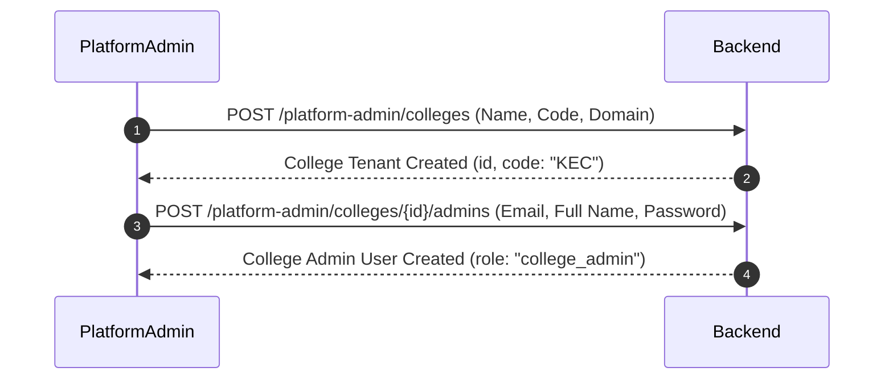
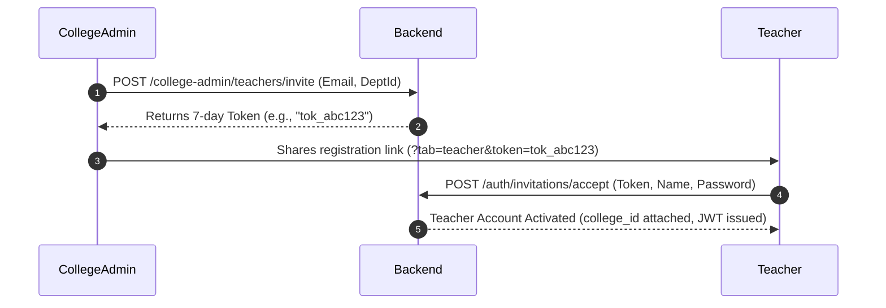
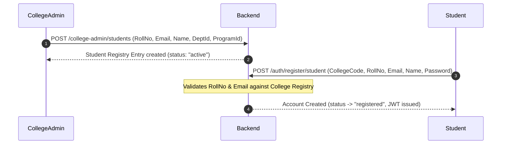
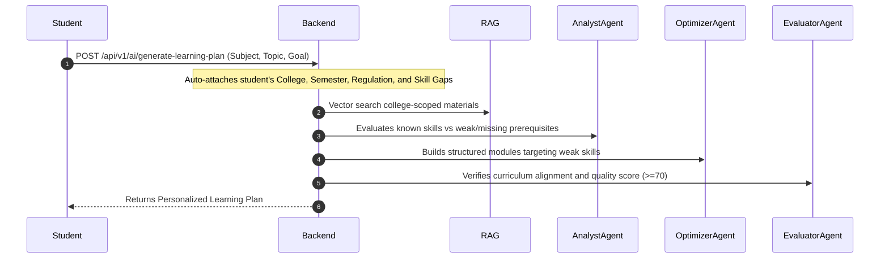
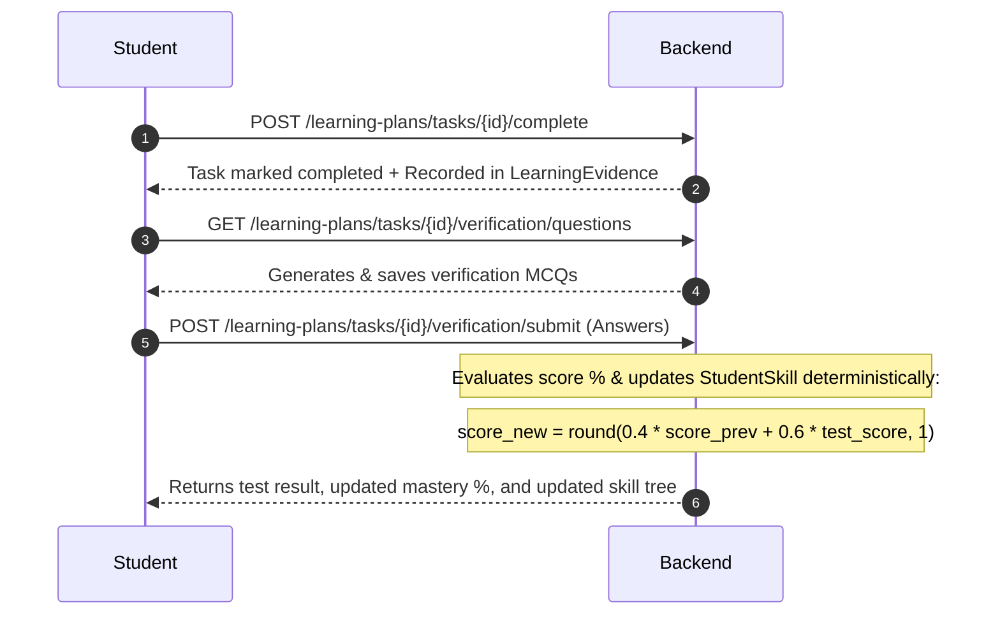

# EduPlanner — Complete System & Architectural Guide

Welcome to **EduPlanner** — a production-grade, multi-tenant adaptive learning SaaS platform designed specifically for colleges and universities.

---

## Table of Contents
1. [Quick Start: How to Open the Admin & Other Pages](#1-quick-start-how-to-open-the-admin--other-pages)
2. [Product Identity & Scope](#2-product-identity--scope)
3. [The 4 Core Roles & Permission Hierarchy](#3-the-4-core-roles--permission-hierarchy)
4. [The 5 End-to-End Required Workflows](#4-the-5-end-to-end-required-workflows)
5. [Learner Model & Deterministic Skill Mastery](#5-learner-model--deterministic-skill-mastery)
6. [Adaptive Multi-Agent AI & RAG Pipeline](#6-adaptive-multi-agent-ai--rag-pipeline)
7. [Database Schema & Multi-Tenant Design](#7-database-schema--multi-tenant-design)
8. [Codebase Architecture & File Map](#8-codebase-architecture--file-map)
9. [Running, Seeding, and Testing Commands](#9-running-seeding-and-testing-commands)

---

## 1. Quick Start: How to Open the Admin & Other Pages

Both backend (`http://127.0.0.1:8000`) and frontend (`http://127.0.0.1:5173`) are currently running.

EduPlanner uses **role-based protected routing**. You cannot open admin pages by typing the URL without being logged in with that role; navigating to `/college-admin/dashboard` while logged out will automatically redirect you to `/login`.

### Demo Accounts Ready in Database:

| Role | Email | Password | Redirected Page | What You See |
| :--- | :--- | :--- | :--- | :--- |
| **Core Adaptive MVP Student** | `student@eduplanner.io` | `Student123!` | [`/student/dashboard`](http://127.0.0.1:5173/student/dashboard) | Section 25 demo state: Recursion 30%, Trees 20%, Binary Trees 10%, BST 0%, Plan 1 & Adaptive Replanning |
| **Platform Super Admin** | `platform.admin@eduplanner.io` | `Admin123!` | [`/platform-admin/dashboard`](http://127.0.0.1:5173/platform-admin/dashboard) | Cross-college SaaS statistics, onboard new colleges, assign college admins |
| **College Admin** | `college.admin@kec.edu` | `Admin123!` | [`/college-admin/dashboard`](http://127.0.0.1:5173/college-admin/dashboard) | Pre-enroll students in Registry, generate teacher invites, manage Departments & Programs |
| **Existing Teacher** | `rdharun036@gmail.com` | *(your teacher password)* | [`/teacher/dashboard`](http://127.0.0.1:5173/teacher/dashboard) | Create classrooms, view enrolled students, upload materials |
| **Existing Student** | `rdharun36@gmail.com` | *(your student password)* | [`/student/dashboard`](http://127.0.0.1:5173/student/dashboard) | Diagnostic assessment, active learning plans, skill tree, classrooms |

---

### Step-by-Step: How to Open the Admin Pages

#### A. Opening the Platform Admin Page:
1. Open your browser to: **[http://127.0.0.1:5173/login](http://127.0.0.1:5173/login)**
2. Enter:
   - **Email**: `platform.admin@eduplanner.io`
   - **Password**: `Admin123!`
3. Click **Sign In**.
4. You are automatically redirected to **`/platform-admin/dashboard`**.
5. Use the sidebar to navigate between:
   - **SaaS Overview**: View total colleges, active students, and faculty.
   - **Colleges & Tenants**: Onboard new college tenants or provision new College Admins.

---

#### B. Opening the College Admin Page:
1. Open your browser to: **[http://127.0.0.1:5173/login](http://127.0.0.1:5173/login)**
2. Enter:
   - **Email**: `college.admin@kec.edu`
   - **Password**: `Admin123!`
3. Click **Sign In**.
4. You are automatically redirected to **`/college-admin/dashboard`**.
5. Use the sidebar to navigate between:
   - **Dashboard**: High-level enrollment metrics and department quick-links.
   - **Student Registry**: Pre-authorize students (roll number + email) before they can register.
   - **Faculty & Invites**: Generate one-time 7-day invitation links for teachers.
   - **Departments & Programs**: Create academic units (e.g., Computer Science, Mechanical).

---

#### C. Testing the Student Institutional Sign-Up Flow:
1. Go to: **[http://127.0.0.1:5173/register](http://127.0.0.1:5173/register)**
2. Ensure the **Student Registration** tab is selected.
3. Enter pre-enrolled registry credentials:
   - **College Code**: `KEC`
   - **Student ID / Roll No**: `21CS042`
   - **Official Email**: `student@kec.edu`
   - **Full Name**: `Arun Kumar`
   - **Create Password**: Any password (e.g. `Student123!`)
4. Click **Verify & Register Student Account**.
5. The system verifies the roll number and email against the college registry, creates the student account, and logs you directly into **`/student/dashboard`**.

---

#### D. Testing the Teacher Invitation Acceptance Flow:
1. Either click the direct link:
   **[http://127.0.0.1:5173/register?tab=teacher&token=kec-teacher-invite-demo-2026](http://127.0.0.1:5173/register?tab=teacher&token=kec-teacher-invite-demo-2026)**
   *Or* navigate to `/register`, click the **Teacher Invitation** tab, and enter:
   - **Invitation Token**: `kec-teacher-invite-demo-2026`
   - **Full Name**: `Prof. Eleanor Vance`
   - **Create Password**: Any password (e.g. `Teacher123!`)
2. Click **Accept Invitation & Activate Account**.
3. You are redirected directly to **`/teacher/dashboard`**.

---

## 2. Product Identity & Scope

EduPlanner is **NOT** a generic ERP, attendance manager, fee collector, or basic chat box.

### Core Value Proposition:
1. **Multi-Tenant College Isolation**: Each college has its own tenant, materials, faculty, departments, and pre-authorized student body.
2. **Persistent Learner Model**: Tracks granular student skills over time with persistent mastery levels and audit-trailed learning evidence.
3. **Adaptive Multi-Agent AI Replanning**: Multi-agent pipeline (**Analyst → Optimizer → Evaluator**) that analyzes missing prerequisites, retrieves college curriculum materials from vector search, and creates customized learning journeys.
4. **Deterministic Mastery Updates**: Skill scores are computed using rigorous mathematical formulas based on verification test results, rather than relying on LLM guesses.

---

## 3. The 4 Core Roles & Permission Hierarchy

```
       ┌────────────────────────┐
       │     PLATFORM_ADMIN     │  (Super-Admin / SaaS Owner)
       └───────────┬────────────┘
                   │ provisions
       ┌───────────▼────────────┐
       │     COLLEGE_ADMIN      │  (Institutional Admin)
       └─────┬────────────┬─────┘
             │ invites    │ enrolls
 ┌───────────▼───┐    ┌───▼───────────┐
 │    TEACHER    │    │    STUDENT    │
 └───────────────┘    └───────────────┘
```

1. **`PLATFORM_ADMIN`**:
   - Manages global colleges/institutions.
   - Creates College Admin accounts for newly onboarded colleges.
   - Monitors platform-wide health and cross-tenant metrics.

2. **`COLLEGE_ADMIN`**:
   - Manages institutional settings for their specific college (`college_id`).
   - Populates the **Student Registry** (pre-approved roll numbers and emails).
   - Generates and manages **Teacher Invitations** with cryptographic tokens.
   - Creates and organizes **Departments** and **Degree Programs**.

3. **`TEACHER`**:
   - Must be invited by a College Admin.
   - Creates classrooms scoped to their college.
   - Uploads curriculum and learning materials (PDFs/notes) into the RAG vector store.
   - Monitors student progress across enrolled classrooms.

4. **`STUDENT`**:
   - Must be pre-approved in their college's registry.
   - Takes baseline diagnostic assessments to establish their skill profile.
   - Generates adaptive AI learning plans tailored to their missing prerequisites.
   - Completes tasks and takes verification tests to systematically boost their mastery level.

---

## 4. The 5 End-to-End Required Workflows

### Workflow 1: Institutional Tenant Onboarding


### Workflow 2: Faculty Invitation & Acceptance


### Workflow 3: Pre-Authorized Student Registration


### Workflow 4: Adaptive Learning Plan Generation


### Workflow 5: Task Completion & Verification Loop


---

## 5. Learner Model & Deterministic Skill Mastery

Unlike typical chat-based apps that ask an LLM to guess a student's grade, EduPlanner uses a **deterministic mathematical update formula** implemented in `backend/app/services/learner_model_service.py`:

$$\text{score}_{\text{new}} = \begin{cases} \text{score}_{\text{test}}, & \text{if first assessment} \\ \text{round}(0.4 \times \text{score}_{\text{prev}} + 0.6 \times \text{score}_{\text{test}}, 1), & \text{subsequent verifications} \end{cases}$$

### Key Components:
- **`StudentSkill`**: Current mastery score (0–100%) for each skill.
- **`StudentSkillHistory`**: Historical log tracking every change in score.
- **`LearningEvidence`**: Immutable ledger of evidence items (task completions, assessment scores, verifications).
- **`Verification`**: Persisted verification tests, questions, student answers, and pass/fail states.

---

## 6. Adaptive Multi-Agent AI & RAG Pipeline

The AI planner uses **LangGraph** with three distinct agents:

```
[Student Request + Verified Metadata + Persistent Skill Gaps]
                             │
                             ▼
                    ┌─────────────────┐
                    │  Analyst Agent  │  Analyzes missing prerequisite skills
                    └────────┬────────┘  (skips topics with >=70% mastery)
                             ▼
                    ┌─────────────────┐
                    │ Optimizer Agent │  Structures sequential lesson modules &
                    └────────┬────────┘  practice activities grounded in RAG docs
                             ▼
                    ┌─────────────────┐
                    │ Evaluator Agent │  Checks pedagogical soundness & grounding
                    └────────┬────────┘  Score >= 70? If not, triggers replanning
                             ▼
            [Final Grounded Learning Plan]
```

- **RAG Vector Search**: Scoped to materials uploaded by teachers of the student's college (`college_id`).
- **Curriculum Grounding**: Incorporates college name, regulation year, and semester to select relevant curriculum standards.

---

## 7. Database Schema & Multi-Tenant Design

The SQLite database (`edu_planner.db`) is structured with foreign keys and multi-tenant scoping:

### Core Tables:
1. **`colleges`**: `id`, `name`, `code` (e.g. `KEC`), `domain`, `description`, `is_active`, `created_at`.
2. **`users`**: `id`, `email`, `hashed_password`, `role` (`platform_admin` | `college_admin` | `teacher` | `student`), `college_id`, `student_registry_id`, `department`, `year_of_study`, `semester`, `regulation`.
3. **`student_registry`**: `id`, `college_id`, `student_identifier`, `official_email`, `full_name`, `department_id`, `program_id`, `batch_year`, `current_semester`, `status` (`active` | `registered` | `inactive`).
4. **`teacher_invitations`**: `id`, `college_id`, `email`, `invitation_token`, `is_used`, `department_id`, `expires_at`, `invited_by_id`.
5. **`departments`**: `id`, `college_id`, `name`, `code`, `description`, `is_active`.
6. **`programs`**: `id`, `department_id`, `name`, `code`, `description`, `is_active`.
7. **`skills` & `skill_prerequisites`**: Domain skills tree and prerequisite graph.
8. **`student_skills` & `student_skill_history`**: Learner mastery tracking.
9. **`learning_evidence` & `verifications`**: Immutable proof of task performance.
10. **`classrooms` & `classroom_members`**: College-scoped class cohorts.
11. **`materials` & `curriculums`**: Documents indexed for RAG vector search.

---

## 8. Codebase Architecture & File Map

### Backend (`Edu-Planner/backend/app/`)
```
app/
├── api/                     # HTTP Endpoints (FastAPI routers)
│   ├── auth.py              # Login, student registry registration, teacher invitation acceptance
│   ├── platform_admin.py    # Colleges, college admins, global SaaS stats
│   ├── college_admin.py     # Registry management, teacher invites, departments, programs
│   ├── ai.py                # LangGraph learning plan generation with student skill gaps
│   ├── learning_plan.py     # Task completions, persistent verification MCQs & test submission
│   ├── skills.py            # Domain skills, student skill gaps, skill tree endpoints
│   ├── teacher.py           # Teacher stats, roster, and classroom views
│   ├── classroom.py         # Multi-tenant classroom management
│   ├── materials.py         # Document upload and RAG retrieval
│   └── assessment.py        # Diagnostic assessments
├── models/                  # SQLAlchemy ORM Models
│   ├── college.py           # College, StudentRegistry, TeacherInvitation
│   ├── user.py              # User with role, college_id, and academic metadata
│   ├── skill.py             # Skill, SkillPrerequisite, StudentSkill, StudentSkillHistory
│   ├── evidence.py          # LearningEvidence, Verification
│   ├── program.py           # Program
│   ├── curriculum.py        # Department, Curriculum
│   └── classroom.py         # Classroom, ClassroomMember
├── services/                # Business Logic Layer
│   ├── auth_service.py      # Registration validation, invitation token validation
│   ├── learner_model_service.py # Deterministic 0.4*prev + 0.6*test mastery calculation
│   └── skill_service.py     # Skill gap calculation & prerequisite checks
├── ai/                      # Multi-Agent Workflow
│   ├── graph.py             # LangGraph state graph
│   ├── state.py             # AgentState (includes academic skills & college_id)
│   └── agents/              # Analyst, Optimizer, Evaluator
└── db/
    └── database.py          # SQLite engine, session factory, auto-migrations
```

### Frontend (`Edu-Planner/frontend/src/`)
```
src/
├── api/                     # Axios API clients
│   ├── auth.ts              # Login, registerStudent, acceptTeacherInvitation
│   ├── platformAdmin.ts     # Platform Admin API client
│   ├── collegeAdmin.ts      # College Admin API client
│   ├── ai.ts                # AI learning plan generation client
│   ├── learningPlans.ts     # Task completion & verification client
│   └── teacher.ts           # Teacher portal client
├── layouts/                 # Role-Specific Shells with Sidebars & Headers
│   ├── PlatformAdminLayout.tsx  # Super-admin navigation layout
│   ├── CollegeAdminLayout.tsx   # College portal navigation layout
│   ├── TeacherLayout.tsx        # Teacher dashboard layout
│   └── StudentLayout.tsx        # Student learning layout
├── pages/
│   ├── auth/
│   │   ├── Login.tsx            # Universal login with role-based routing
│   │   └── Register.tsx         # Tabbed: Student Registry Registration & Teacher Invites
│   ├── platform_admin/
│   │   ├── PlatformAdminDashboard.tsx # Global SaaS overview
│   │   └── CollegeManager.tsx         # Onboard colleges & assign college admins
│   ├── college_admin/
│   │   ├── CollegeAdminDashboard.tsx  # College analytics & quick actions
│   │   ├── StudentRegistryManager.tsx # Pre-authorize students in registry
│   │   ├── TeacherInviteManager.tsx   # Generate & copy 7-day teacher invites
│   │   └── AcademicStructureManager.tsx # Departments & degree programs
│   ├── teacher/
│   │   ├── TeacherDashboard.tsx       # Classrooms, stats, material uploads
│   │   └── StudentViewer.tsx          # Student progress inspector
│   └── student/
│       ├── StudentDashboard.tsx       # Main student dashboard
│       ├── LearningPlanGenerator.tsx  # Auto-attaches verified college profile
│       ├── SkillTree.tsx              # Interactive visual skill mastery tree
│       ├── Assessment.tsx             # Baseline diagnostic test
│       └── StudentClassroom.tsx       # Enrolled classes
├── routes/
│   └── ProtectedRoute.tsx   # Role-guarded route protection & redirects
└── App.tsx                  # Master route registry
```

---

## 9. Running, Seeding, and Testing Commands

### To Run the Servers (if not already running):

**Backend (Terminal 1):**
```powershell
cd d:\Edu_Planner\Edu-Planner\backend
d:\Edu_Planner\.venv\Scripts\python.exe -m uvicorn app.main:app --host 127.0.0.1 --port 8000
```

**Frontend (Terminal 2):**
```powershell
cd d:\Edu_Planner\Edu-Planner\frontend
npm run dev
```

---

### To Re-Seed Demo Accounts Anytime:
```powershell
cd d:\Edu_Planner\Edu-Planner\backend
d:\Edu_Planner\.venv\Scripts\python.exe scripts/seed_demo_data.py
```

---

### To Run All Backend Automated Tests:
```powershell
cd d:\Edu_Planner\Edu-Planner\backend
d:\Edu_Planner\.venv\Scripts\python.exe -m pytest
```
*(Result: 53 passed, 0 failed in ~17s)*

---

### To Typecheck & Build the Frontend:
```powershell
cd d:\Edu_Planner\Edu-Planner\frontend
npx tsc --noEmit
npm run build
```
*(Result: 0 errors; production bundle built cleanly in ~3.5s)*
